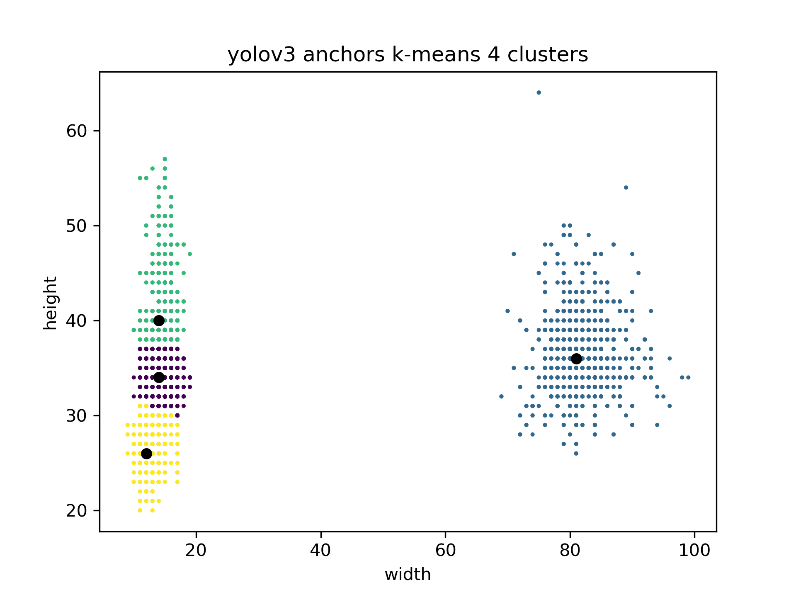

# yolov3-anchor-clustering
Python script to run k-means clustering on any yolov3 format dataset to find appropriate anchors

### Requires

```
import glob
import numpy as np
from sklearn.cluster import KMeans
import matplotlib.pyplot as plt
import numpy as np
```

### Insructions

1. Keep the .data file and the folder containing all .txt annotations in the path

2. Run anchor.py ` (python anchor.py) `

3. The cluster will be stored in cluster.png

<hr>


<hr>

4. The output will be- 
```
    anchors are : [[14 34]
                 [81 36]
                 [12 26]
                 [14 40]]
```
